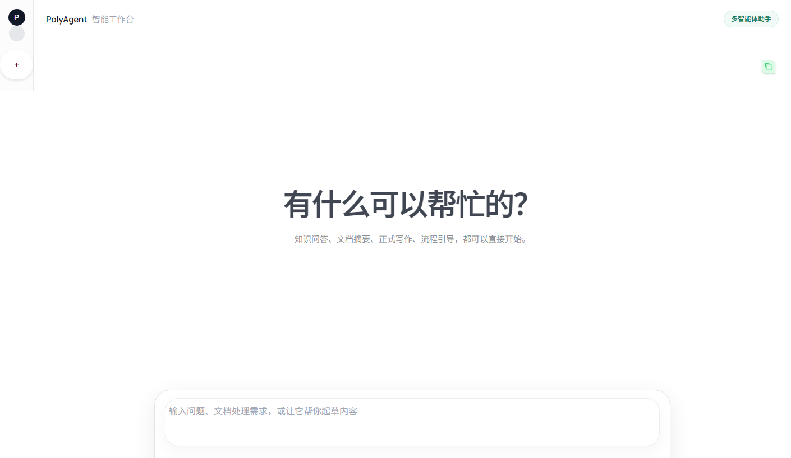
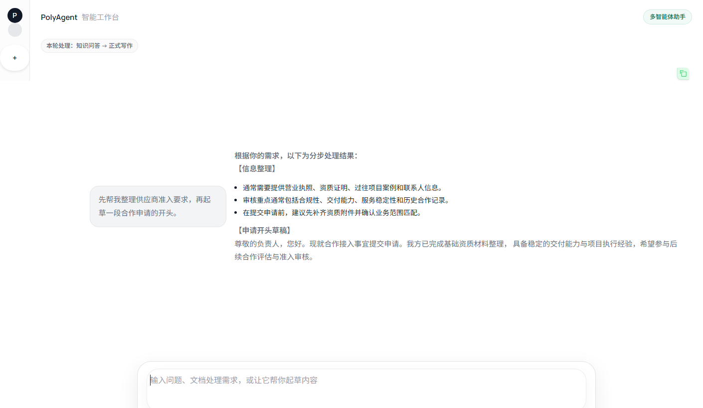
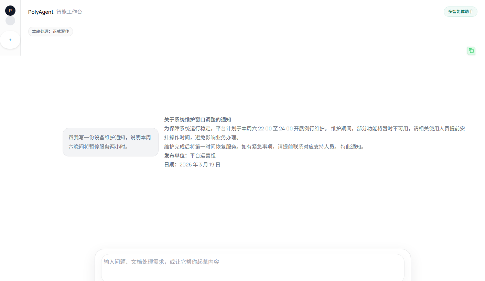

# PolyAgent

[English](./README.md) | [简体中文](./README.zh-CN.md)

PolyAgent is a multi-agent assistant for knowledge-heavy service workflows. It combines intent routing, task orchestration, retrieval-augmented generation, structured writing, and step-by-step guidance in a single chat experience.

The current repository ships with Chinese prompts, examples, and UI copy, but the architecture itself is domain-agnostic. You can adapt it to internal knowledge bases, support desks, operations workflows, education services, or public-facing assistants.

## Demo

Desktop home



Feature highlights

| Multi-agent orchestration | Document summarization |
| --- | --- |
|  |  |
| Formal writing | Step-by-step guidance |
|  |  |

## What It Can Do

- Answer questions from a private knowledge base with grounded retrieval.
- Summarize long text or uploaded documents into structured takeaways.
- Draft formal or structured documents from short instructions.
- Guide users through multi-step processes in conversational form.
- Break a compound request into multiple subtasks and execute them in sequence.

## How It Works

1. Prepare and compress conversation context.
2. Route the request to one or more specialist agents.
3. Execute task-specific agents for QA, summarization, writing, and guidance.
4. Merge the outputs into one final response for the user.

## Quick Start

```bash
git clone https://github.com/Powfu-zwx/PolyAgent.git
cd PolyAgent

python -m venv .venv
source .venv/bin/activate
# Windows: .venv\Scripts\activate

pip install -r requirements.txt
```

Create a `.env` file from the template and fill in your keys:

```bash
cp .env.example .env
```

Required environment variables:

- `DEEPSEEK_API_KEY`
- `DASHSCOPE_API_KEY`

If you want retrieval-based answers, add your Markdown documents under `knowledge/data/` and build the vector index:

```bash
python -m knowledge.vectorstore build
```

Launch the chat UI:

```bash
python ui.py
```

Then open `http://127.0.0.1:7860`.

## Using Your Own Knowledge Base

PolyAgent expects Markdown documents under `knowledge/data/`. Lightweight YAML metadata such as `title`, `category`, `source`, and `date` is recommended for better retrieval and traceability.

After updating the documents, rebuild the vector index:

```bash
python -m knowledge.vectorstore build
```

## Adapting It To Your Domain

To repurpose the project for a different domain or language, update:

- `agents/` for prompts, task behavior, and writing templates
- `knowledge/data/` for your knowledge source documents
- `ui.py` for interface copy and example prompts
- `config/settings.py` for model and provider configuration

If you change the knowledge taxonomy, also review any category-specific retrieval logic in the agents.

## Screenshot Assets

README screenshots can be regenerated with:

```bash
python -m pip install selenium
python scripts/generate_readme_screenshots.py
```

## Tech Stack

- LangGraph for orchestration
- LangChain for LLM integration
- Chroma for vector retrieval
- Gradio for the chat UI
- DeepSeek and Qwen-compatible OpenAI-style endpoints for model access
- pytest for testing

## License

MIT
