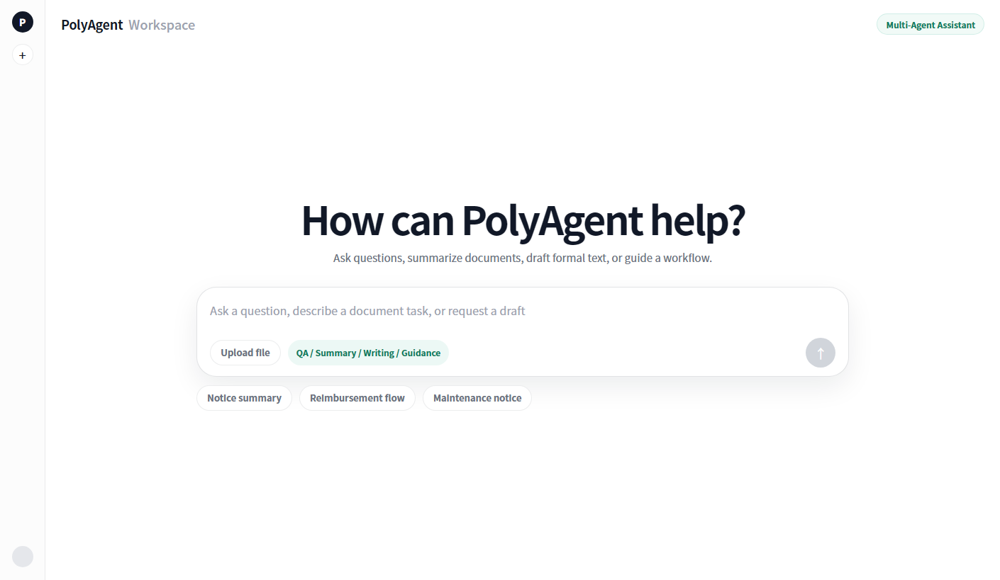
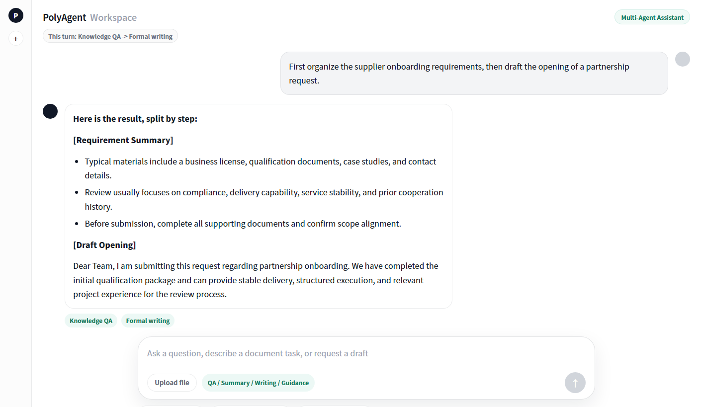
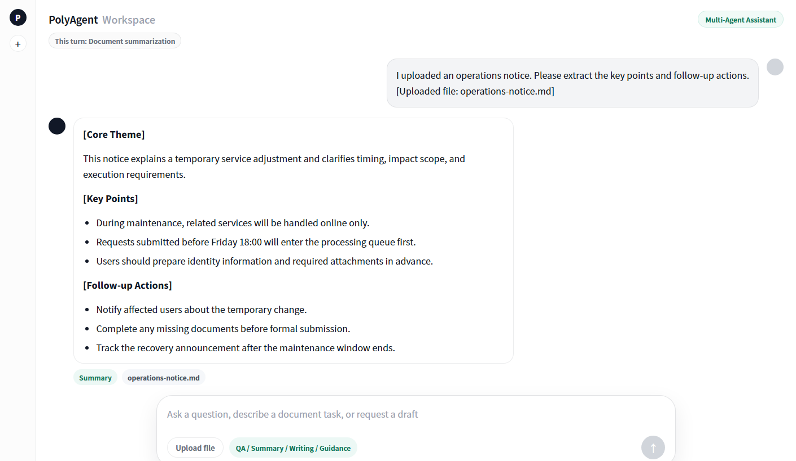
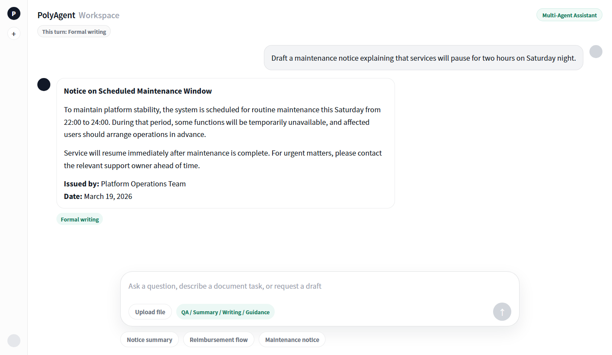
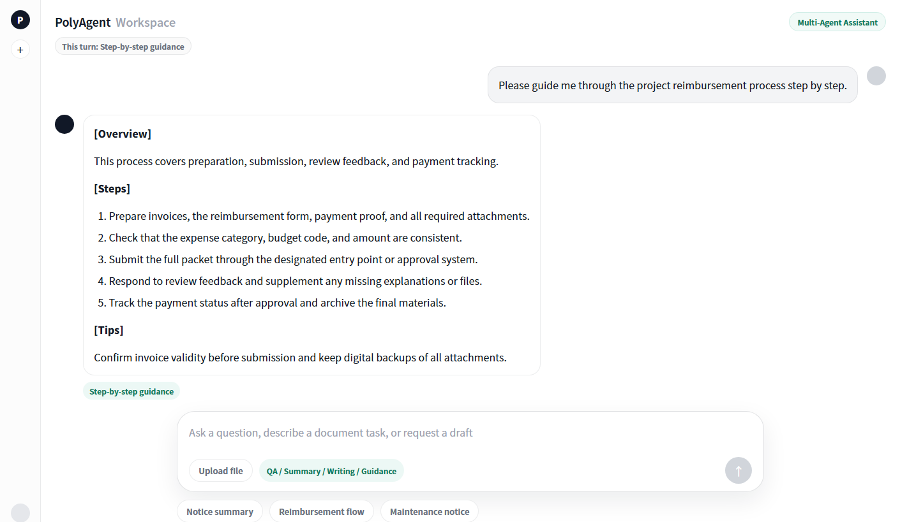

# PolyAgent

[](./pyproject.toml)
[](./LICENSE)
[](./docs/releases/v0.1.0.md)

[简体中文](./README.zh-CN.md)

PolyAgent is a multi-agent workspace for knowledge-heavy service workflows. It combines grounded QA, document summarization, formal writing, and step-by-step guidance in one chat interface.

The current repository ships with Chinese prompts, example data, and UI copy, while the architecture itself remains domain-agnostic. You can adapt it to internal knowledge bases, service desks, operations workflows, education scenarios, or public-facing assistants.

Recommended entrypoint: run `python app.py` for the primary web workspace.

## Why PolyAgent

- One workspace, four core capabilities: QA, summary, writing, and guidance.
- Multi-agent routing for compound requests such as "find the policy and draft the reply".
- RAG-ready knowledge flow with Markdown sources, vector retrieval, and traceable context.
- Demo-friendly UI assets for README screenshots, release notes, and social distribution.

## Demo

Desktop home



Capability gallery

| Multi-agent orchestration | Document summarization |
| --- | --- |
|  |  |
| Formal writing | Step-by-step guidance |
|  |  |

## Core Capabilities

- Answer questions from a private knowledge base with retrieval-backed context.
- Summarize uploaded files or long-form text into structured takeaways.
- Draft formal notices, applications, or structured business copy from short prompts.
- Guide users through multi-step procedures in a conversational way.
- Decompose one request into multiple subtasks and execute them sequentially.

## Quick Start

Requirements

- Python 3.10+
- `DEEPSEEK_API_KEY`
- `DASHSCOPE_API_KEY`

Install

```bash
git clone https://github.com/Powfu-zwx/PolyAgent.git
cd PolyAgent

python -m venv .venv
source .venv/bin/activate
# Windows: .venv\Scripts\activate

pip install -r requirements.txt
cp .env.example .env
```

Default run path

```bash
python app.py
```

Then open `http://127.0.0.1:8000`.

If you want retrieval-based answers, put your Markdown documents under `knowledge/data/` and build the vector index:

```bash
python -m knowledge.vectorstore build
```

If you are coming to the project for the first time, use the `app.py` route above. The `ui.py` entrypoint is kept only as an alternate Gradio demo interface.

## How It Works

1. Prepare and compress the current conversation context.
2. Route the user request into one or more specialist intents.
3. Execute task-specific agents for QA, summary, writing, and guidance.
4. Aggregate results into one final response.

## Typical Use Cases

- Internal knowledge base assistant for policy or procedure lookup
- Service desk or operations helper for multi-step internal workflows
- Document assistant for notices, summaries, and structured writing
- Scenario demos for LangGraph, RAG, and multi-agent orchestration

## Repository Map

- `agents/`: prompt logic and task-specific agent behavior
- `core/`: routing, state, orchestration, and chat service helpers
- `knowledge/`: Markdown corpus and vector retrieval pipeline
- `app.py`: recommended FastAPI entrypoint for the primary web workspace
- `ui.py`: secondary Gradio demo entrypoint
- `docs/`: release notes, launch kit, and image assets

## Release Readiness

- Release notes: [`v0.1.0`](./docs/releases/v0.1.0.md)
- Changelog: [`CHANGELOG.md`](./CHANGELOG.md)
- Roadmap: [`ROADMAP.md`](./ROADMAP.md)
- Launch kit: [`docs/launch-kit.md`](./docs/launch-kit.md)

Current known limitations

- API keys are required for DeepSeek and DashScope-compatible model access.
- The out-of-the-box prompts and seed data are still Chinese-first.
- A hosted demo and short walkthrough video are not included yet.

## Using Your Own Knowledge Base

PolyAgent expects Markdown documents under `knowledge/data/`. Lightweight YAML metadata such as `title`, `category`, `source`, and `date` is recommended for better retrieval quality and traceability.

After updating your documents, rebuild the vector index:

```bash
python -m knowledge.vectorstore build
```

## Screenshot Assets

README screenshots can be regenerated with:

```bash
pip install ".[assets]"
python scripts/generate_readme_screenshots.py
python scripts/generate_social_preview.py
```

The screenshot script generates both English (`*-en.png`) and Simplified Chinese (`*-zh.png`) variants. The social preview script outputs `docs/images/polyagent-social-preview.png`.

## Tech Stack

- LangGraph for orchestration
- LangChain for LLM integration
- Chroma for vector retrieval
- FastAPI plus a custom web client for the primary workspace
- Gradio as an alternate demo interface
- DeepSeek and Qwen-compatible OpenAI-style endpoints for model access
- pytest for testing

## License

MIT
