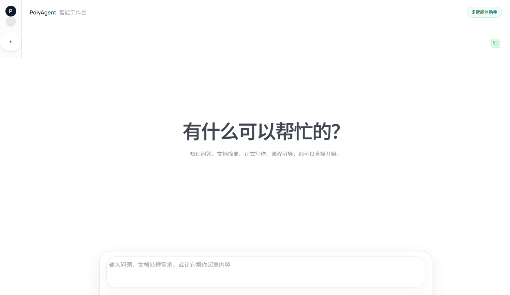
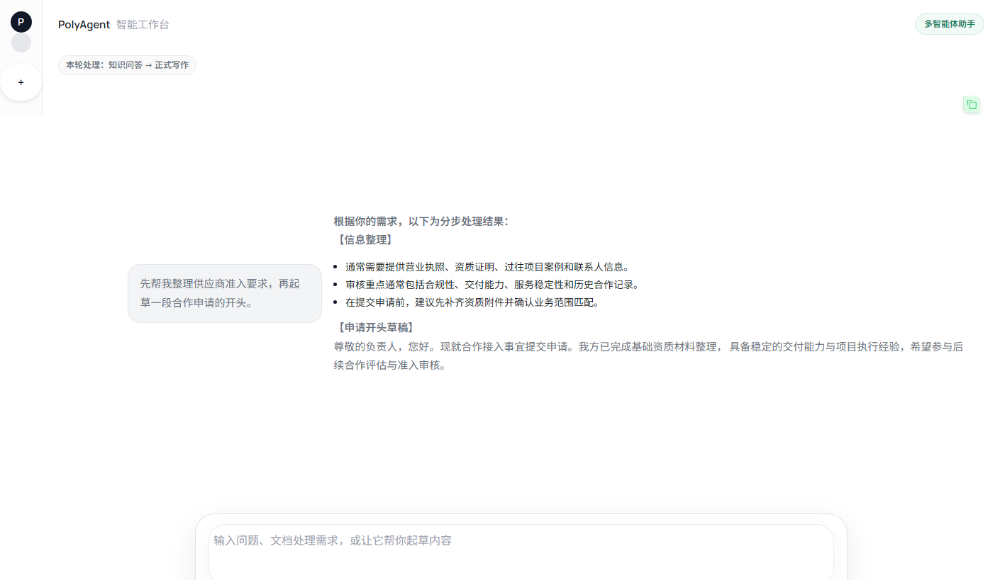
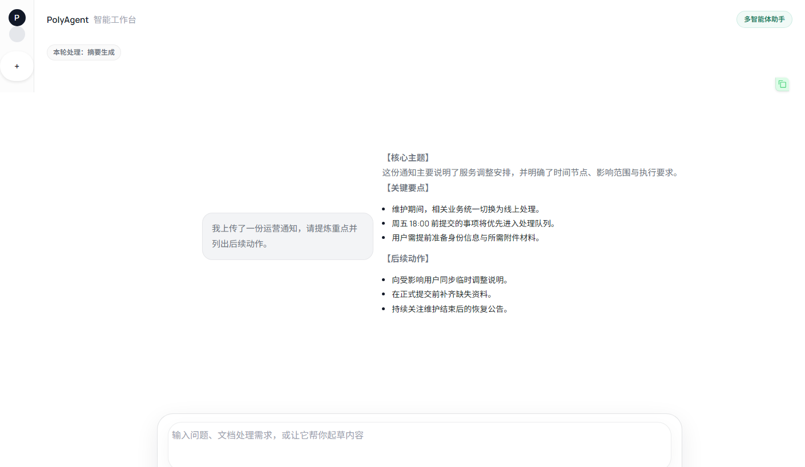
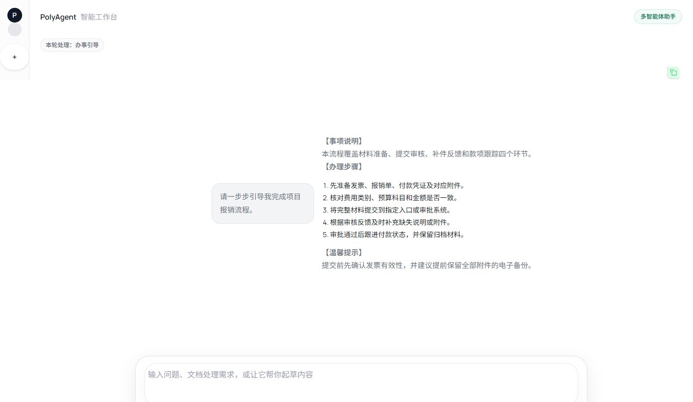

# PolyAgent

[English](./README.md) | [简体中文](./README.zh-CN.md)

PolyAgent 是一个面向知识密集型服务场景的多智能体助手框架。它把意图路由、任务编排、检索增强生成、结构化写作和分步式流程引导整合进一个统一的聊天式交互界面。

当前仓库默认自带中文提示词、中文示例和中文界面文案，但整体架构本身是通用的。你可以把它迁移到内部知识库问答、客服支持、业务流程助手、教育服务或面向公众的服务型智能体场景中。

## Demo

桌面端首页



功能展示

| 多智能体编排 | 文档摘要 |
| --- | --- |
|  |  |
| 正式文稿写作 | 分步流程引导 |
|  |  |

## 这个项目能做什么

- 基于私有知识库进行带检索依据的问答。
- 对长文本或上传文档生成结构化摘要。
- 根据简短需求生成正式或结构化文稿。
- 以对话方式引导用户完成多步骤流程。
- 将一条复合请求拆解成多个子任务并按顺序执行。

## 工作方式

1. 先整理并压缩当前对话上下文。
2. 将用户请求路由到一个或多个专业 Agent。
3. 执行知识问答、摘要生成、文稿写作、流程引导等任务。
4. 将多个执行结果聚合成最终回复。

## 快速开始

```bash
git clone https://github.com/Powfu-zwx/PolyAgent.git
cd PolyAgent

python -m venv .venv
source .venv/bin/activate
# Windows: .venv\Scripts\activate

pip install -r requirements.txt
```

根据模板创建 `.env` 并填入密钥：

```bash
cp .env.example .env
```

必需环境变量：

- `DEEPSEEK_API_KEY`
- `DASHSCOPE_API_KEY`

如果你希望启用基于知识库的检索问答，请先把 Markdown 文档放到 `knowledge/data/` 下，然后构建向量索引：

```bash
python -m knowledge.vectorstore build
```

启动聊天界面：

```bash
python ui.py
```

然后访问 `http://127.0.0.1:7860`。

## 使用你自己的知识库

PolyAgent 默认从 `knowledge/data/` 中读取 Markdown 文档。建议为文档补充轻量级 YAML 元数据，例如 `title`、`category`、`source`、`date`，这样更有利于检索和来源追踪。

更新文档后，重新构建向量索引：

```bash
python -m knowledge.vectorstore build
```

## 如何迁移到你的业务场景

如果你想把项目改造成其他领域或其他语言版本，主要需要调整：

- `agents/`：提示词、任务行为、写作模板
- `knowledge/data/`：你的知识文档
- `ui.py`：界面文案和示例提示
- `config/settings.py`：模型与服务提供方配置

如果你修改了知识库分类方式，也要顺带检查各个 Agent 中与分类过滤相关的检索逻辑。

## 截图资源

README 演示图可通过以下命令重新生成：

```bash
python -m pip install selenium
python scripts/generate_readme_screenshots.py
```

该脚本会同时生成英文版 (`*-en.png`) 和中文版 (`*-zh.png`) 两套截图。

## 技术栈

- LangGraph：多智能体编排
- LangChain：LLM 集成
- Chroma：向量检索
- Gradio：聊天界面
- DeepSeek 与兼容 OpenAI 风格接口的 Qwen 服务
- pytest：测试

## 许可证

MIT
